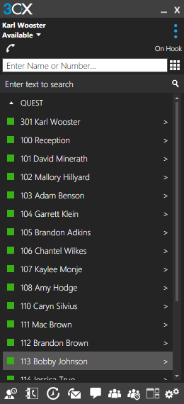

# 3CX
hotkey for easily switching to 3CX and getting ready for number input

## 3CX Script
This is a compiled [AutoHotKey](https://autohotkey.com/ "AutoHotKey's Homepage") script that makes it easy to switch to 3CX.

Simply press CTRL+ALT+\ (the one above the Enter key) to switch to the open 3CX window and clear any existing number and get ready to input a number.

Make sure to have 3CX running or you'll get an error message

Also, a real limitation is that it must be on the screen that allows direct number entry:

_Please let me know if you find any issues_